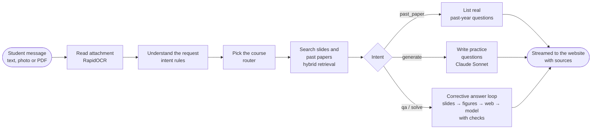
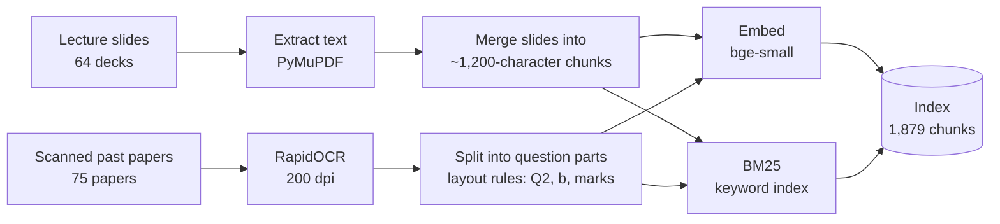
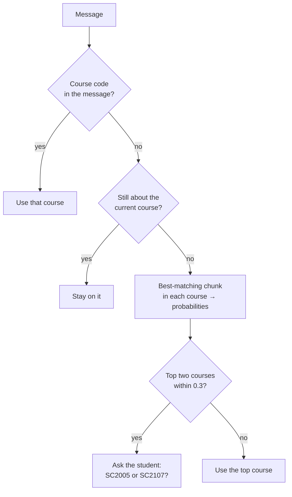
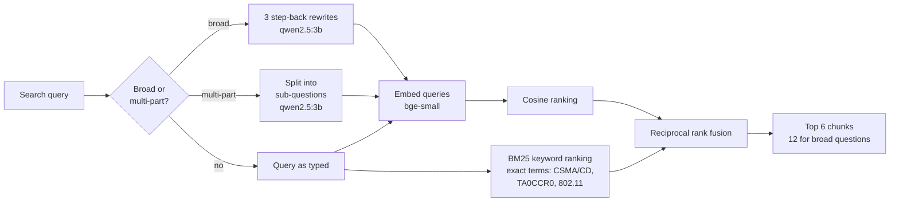
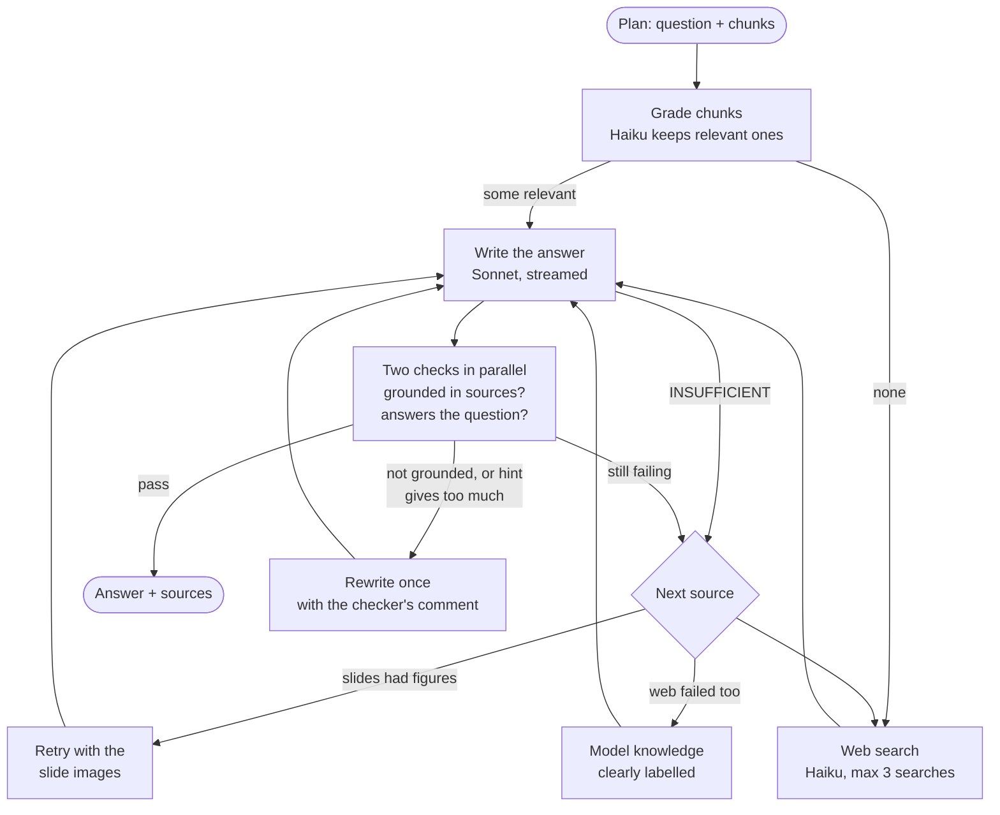

<p align="center">
  
</p>

<h1 align="center">NTU Course Tutor</h1>

<p align="center">
  <b>A study partner that has read every lecture slide and past-year paper of your NTU courses.</b><br />
  Ask a question, look up past-year questions, or get a hint on an exercise. It answers from the slides and shows you the exact slides it used.
</p>

<p align="center">
  SC2001 Algorithms · SC2005 Operating Systems · SC2006 Software Engineering · SC2008 Computer Networks · SC2107 Microprocessors
</p>

---

## What it does

Revising for an NTU exam usually means flipping through hundreds of slides and a stack of scanned past papers. Course Tutor does that part for you:

- **📖 Explains topics from your own slides.** Ask "What is a microprocessor?" and the answer is built from your course's lectures, with every claim pointing to its slide. Click a citation to open that slide.
- **🗂️ Finds past-year questions.** "Show me past year questions on deadlock" lists the real exam questions on that topic, with marks and year.
- **💡 Tutors you instead of just answering.** On any exercise, ask for a **hint** first: it names the idea and the formula you need, without doing the working. Ask again for a stronger hint, or for the **full solution**.
- **✍️ Writes new practice questions** in the style of the past papers, with model answers.
- **📷 Reads photos and PDFs.** Snap a tutorial question, paste a screenshot or drop a PDF, and ask about it.
- **🧭 Picks the right course itself**, and asks you when a question could belong to two.
- **🛡️ Checks itself before you see the answer.** If the slides can't answer something, it says so and searches the web, labelling where the answer came from.

## Demo

<p align="center">
  <a href="demo/ntu-course-tutor-demo.mp4"></a>
  <br />
  <sub>Click for the full 50-second video: an explanation with slide citations, opening a cited slide, a past-year lookup, and a hint.</sub>
</p>

---

## How it works

### The whole pipeline

Every message goes through the same steps. The rule-based steps are free and run locally; paid model calls are used only where the free option measurably fell short.



There are four kinds of request (intents), detected with rules, no model call:

| Intent | Example | What happens |
|---|---|---|
| `qa` | "Explain how CRC works" | answered from the slides through the corrective loop |
| `solve` | "Give me a hint for SC2008 AY2526 S2 Q1(15)", or a pasted question | the exercise is found, then hinted or solved through the corrective loop |
| `past_paper` | "Past year questions on deadlock" | a search over the exam questions; no model call, instant |
| `generate` | "Give me 2 practice questions on paging" | new questions written from the slides and similar past questions |

### Models at a glance

| Job | Model | Runs |
|---|---|---|
| Text embeddings | `BAAI/bge-small-en-v1.5` (fastembed) | locally, free |
| Keyword search | BM25 (own numpy implementation) | locally, free |
| OCR of scanned papers and uploads | RapidOCR | locally, free |
| Query rewrites for broad and multi-part questions | `qwen2.5:3b` via Ollama | locally, free |
| Writing answers, hints and practice questions | Claude Sonnet 5.5 | API |
| Grading chunks, checking answers, web search | Claude Haiku 4.5 | API |
| Checking answers that used slide or exam images | Claude Sonnet 5.5 | API |

### 1. Ingestion: turning PDFs into a search index (offline)



- **Slides** are merged into chunks of about 1,200 characters, keeping the slide numbers so answers can cite them.
- **Past papers** are scans, so they are OCR'd locally. Layout rules then split each paper into question parts such as `Q2(b)`, with marks, year and semester, and a flag for parts that refer to a figure. Rotated two-page scans and watermarks are handled.
- The index holds **962 slide chunks and 917 exam question parts**. Search is a single numpy matrix multiply, so no vector database is needed.

### 2. Understanding the request and picking the course



- **Rules, not a model**, decide the intent, and parse references like `AY2526 S2 Q1(15)`, "another hint" and "full solution". They get the intent right on 100% of the test set.
- **One course per answer.** A course code wins; otherwise the conversation stays on its course while the question still fits; otherwise the course whose best slide matches best. A shared term such as "interrupt" therefore stays with the course you are studying.

### 3. Retrieval: hybrid search



- **Two searches run side by side and are merged.** Embeddings understand paraphrases ("how does the CPU stop what it's doing" → interrupts). BM25 matches special terms one-to-one, such as register names, acronyms and standards, which embeddings blur. Reciprocal rank fusion merges the two rankings.
- **Broad questions** ("Explain the data link layer") are detected by a specificity score: how rare the question's words are, plus how clearly one slide stands out. They get three step-back rewrites from a small local model, so the answer covers the whole topic.
- **Multi-part questions** ("difference between paging and segmentation") are split, so both parts are found.
- Rewrites only widen the search. They never choose the course, and they never write the answer.

### 4. Answering: the corrective loop

Explanations and exercises go through a self-checking loop built with LangGraph. It tries the cheapest trustworthy source first and moves on only when an answer fails its checks.



- **Sources in order:** slide text → slide text plus figure images → web search → the model's own knowledge. Every answer is labelled with its source.
- **Figures.** OCR can't read diagrams. When a past-paper question refers to a figure, the scanned exam page is attached. Slide diagrams are attached only as a fallback, when the text-only answer fails, which saves tokens on the many questions that don't need them.
- **Hints.** Level 1 names the concept and the exact formula or rule, and asks a guiding question. Level 2 carries out the first step. A dedicated check rejects any hint that gives the answer away.
- **Streaming.** The answer appears while it is written, about 5–6 seconds after you ask; the checks run when it is complete. In the rare case a check rejects it, the text is replaced by a corrected version.

---

## Results

All numbers come from the scripts in [`eval/`](eval/README.md), on test sets written for this project.

### Retrieval and routing: 164 questions, free to run

| Metric | Result |
|---|---|
| Intent detected correctly | **100%** |
| Course picked correctly | **92.1%** (asks the student 7.3%, wrong 0.6%) |
| Correct lecture in the top 6 chunks | **99.4%** |
| Correct lecture in the top 3 | 95.7% |
| Correct lecture ranked first | 86.0% |
| Paraphrased questions without the slide's terms, top 6 | 97.1% |
| Broad questions, top 6 | 100% |
| Past-year lookup: on-topic questions in the top 5 | 78% |

How each technique moved retrieval (correct lecture in top 6):

| Change | Before | After |
|---|---|---|
| Step-back rewrites for broad questions (with hybrid search) | 93.3% (broad group) | 100% |
| Hybrid search, BM25 + embeddings | 97.6% overall | 99.4% overall |
| Hybrid search on paraphrased questions | 88.6% | 97.1% |

### Answer quality

| Test | Result |
|---|---|
| Past-year exercises solved correctly (21, graded against reference answers) | **98%**, key points 98% |
| Hints judged useful | 20 / 21 |
| Hints that give away the answer | **0 / 21** |
| Figure questions, scanned page attached vs OCR text only | **100%** vs 40% |
| Diagram questions, slide images always vs as fallback vs text only | 100% vs 92% vs 58% |
| In-syllabus questions answered from the slides | 7 / 8 |
| Out-of-syllabus questions sent to web search | 10 / 10 |

### Latency

| Request | Typical time |
|---|---|
| Past-year lookup | under 1 second (no model call) |
| Explanation from the slides: first text on screen | **~5.7 s** |
| Explanation from the slides: finished and checked | ~9–10 s |
| Broad question (adds the local rewrites) | +3–6 s |
| Answer that needed web search | ~25–40 s |
| Answer from model knowledge (rare) | ~50–80 s |

Where the time goes for a normal question: grading chunks 1–2 s → writing the answer 5–7 s → both checks together about 1 s. Retrieval itself takes about 0.3 s.

### Token usage

| Setting | Input tokens / question | Output tokens / question | Claude calls |
|---|---|---|---|
| Slide images as fallback (default) | ~12,300 | ~1,600 | ~4.6 |
| Slide images always attached | ~18,300 | ~2,000 | ~4.5 |

### Trade-offs we chose

| Decision | Gain | Cost |
|---|---|---|
| Slide images only as a fallback | about 33% fewer input tokens on normal questions | 92% instead of 100% on diagram questions |
| Streaming before the checks finish | text appears in ~5.7 s instead of ~10 s | rarely, a shown answer is replaced by a revision |
| Hybrid search | top-6 hits 97.6% → 99.4% | correct lecture ranked first 87.2% → 86.0% |
| Haiku for grading, checks and web search; Sonnet only to write | cheaper, faster checks | Haiku misread dense diagrams, so image answers are checked by Sonnet |
| At most 3 web searches | the same accuracy as 5 searches at about half the cost | fewer sources per web answer |
| Local rewrites only for broad and multi-part questions | 2–5 s saved on the other two thirds of questions | always rewriting would have hurt easy questions anyway |
| Rules for intent instead of a model | free, instant, 100% on the test set | new phrasings need a rule |

---

## Project structure

```
backend/                 Python: the RAG pipeline and its web API
  config.py              paths, models and tuning settings
  llm.py                 Claude client and usage counters
  attachments.py         reading images and PDFs the student uploads
  server.py              web API for the frontend (FastAPI)
  cli.py                 chat in the terminal
  ingest/                offline: build what the tutor searches
    ocr_papers.py        OCR of the scanned past papers -> ocr/
    exams.py             OCR text -> past-paper question parts
    build_index.py       slides + question parts -> embeddings in index/
  retrieval/             finding material
    query.py             intent rules, paper references, query rewrites (local Ollama model)
    router.py            picks one course per question
    embedding.py         local embeddings (bge-small)
    keyword.py           BM25 keyword search (exact special terms)
    index.py             the search index: hybrid search, embeddings + BM25 merged with RRF
  answering/             producing the answer
    planner.py           intent, exercise, course and retrieved chunks for one request
    prompts.py           system prompts and message layout
    figures.py           exam page and slide images for figures
    corrective.py        answer loop: slides -> slides + figures -> web -> model knowledge, with checks
    practice.py          practice-question generation
    session.py           one conversation: state between turns, events for the UI
frontend/                React + Vite website
eval/                    evaluation scripts, test sets (datasets/) and cached results (results/)
demo/                    demo video and GIF
data/                    course PDFs: data/<course>/ slides and *_Questions.pdf papers (not in git)
ocr/  index/             generated from data/ (not in git)
```

## Getting started

You need Python 3.14 (a virtual environment in `.venv`), Node.js with Yarn, and an Anthropic API key in `.env`:

```
ANTHROPIC_API_KEY=sk-ant-...
```

Optional: [Ollama](https://ollama.com) with `qwen2.5:3b` for the broad-question rewrites. Without it the tutor still works and skips those rewrites.

### Run

From the project folder:

```
# web API (terminal 1)
.venv/Scripts/python -m uvicorn backend.server:app --port 8000

# website (terminal 2)
cd frontend
yarn dev

# or chat in the terminal instead
.venv/Scripts/python -m backend.cli
```

Then open the address Vite prints, usually http://localhost:5173. Keep both terminals open while you use it.

### Rebuild the data

Run these after adding or changing PDFs in `data/`:

```
.venv/Scripts/python -m backend.ingest.ocr_papers     # OCR new past papers (skips ones already done)
.venv/Scripts/python -m backend.ingest.build_index    # re-chunk and re-embed everything
```

### Evaluate

See [eval/README.md](eval/README.md). `eval/run_eval.py` is free and checks intent, routing and retrieval; run it after every change to the pipeline.

---

<sub>Course material (slides and past papers) belongs to NTU and is not included in this repository.</sub>
