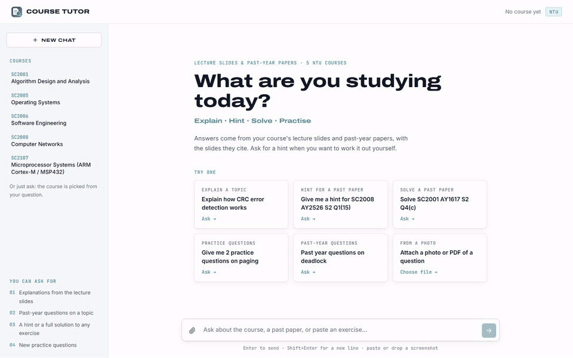

<p align="center">
  
</p>

<h1 align="center">NTU Course Tutor</h1>

<p align="center">
  <b>A study partner that has read every lecture slide and past-year paper of your NTU courses.</b><br />
  Ask a question, look up past-year questions, or get a hint on an exercise. It answers from the slides and shows you the exact slides it used.
</p>

<p align="center">
  SC2001 Algorithms · SC2005 Operating Systems · SC2006 Software Engineering · SC2008 Computer Networks · SC2107 Microprocessors
</p>

---

## What it does

Revising for an NTU exam usually means flipping through hundreds of slides and a stack of scanned past papers. Course Tutor does that part for you:

- **📖 Explains topics from your own slides.** Ask "What is a microprocessor?" and the answer is built from your course's lectures, with every claim pointing to its slide. Click a citation to open that slide.
- **🗂️ Finds past-year questions.** "Show me past year questions on deadlock" lists the real exam questions on that topic, with marks and year.
- **💡 Tutors you instead of just answering.** On any exercise, ask for a **hint** first: it names the idea and the formula you need, without doing the working. Ask again for a stronger hint, or for the **full solution**.
- **✍️ Writes new practice questions** in the style of the past papers, with model answers.
- **📷 Reads photos and PDFs.** Snap a tutorial question, paste a screenshot or drop a PDF, and ask about it.
- **🧭 Picks the right course itself**, and asks you when a question could belong to two.
- **🛡️ Checks itself before you see the answer.** If the slides can't answer something, it says so and searches the web, labelling where the answer came from.

## Demo

<p align="center">
  <a href="demo/ntu-course-tutor-demo.mp4"></a>
  <br />
  <sub>Click for the full 50-second video: an explanation with slide citations, opening a cited slide, a past-year lookup, and a hint.</sub>
</p>

---

## How it works

### The whole pipeline

Every message goes through the same steps. The rule-based steps are free and run locally; paid model calls are used only where the free option measurably fell short.

<p align="center">
  
</p>

There are four kinds of request (intents), detected with rules, no model call:

| Intent | Example | What happens |
|---|---|---|
| `qa` | "Explain how CRC works" | answered from the slides through the corrective loop |
| `solve` | "Give me a hint for SC2008 AY2526 S2 Q1(15)", or a pasted question | the exercise is found, then hinted or solved through the corrective loop |
| `past_paper` | "Past year questions on deadlock" | a search over the exam questions; no model call, instant |
| `generate` | "Give me 2 practice questions on paging" | new questions written from the slides and similar past questions |

### Models at a glance

| Job | Model | Runs |
|---|---|---|
| Text embeddings | `BAAI/bge-small-en-v1.5` (fastembed) | locally, free |
| Keyword search | BM25 (own numpy implementation) | locally, free |
| OCR of scanned papers and uploads | RapidOCR | locally, free |
| Query rewrites for broad and multi-part questions | `qwen2.5:3b` via Ollama | locally, free |
| Writing answers, hints and practice questions | Claude Sonnet 5.5 | API |
| Grading chunks, checking answers, web search | Claude Haiku 4.5 | API |
| Checking answers that used slide or exam images | Claude Sonnet 5.5 | API |

### 1. Ingestion: turning PDFs into a search index (offline)

<p align="center">
  
</p>

#### How lecture slides are chunked

A single slide is usually too short to search well ("Insertion Sort · Idea · ▶ sorted part"), and a whole deck is far too long. So consecutive slides are **merged into chunks of about 1,200 characters**:

1. Extract each slide's text with PyMuPDF and collapse extra spaces and blank lines.
2. **Skip near-empty slides** (under 20 characters: title cards, section dividers, image-only slides).
3. Add slides to the current chunk, each prefixed with a marker such as `[slide 8]`, until the next one would push it past 1,200 characters; then start a new chunk.
4. A single very dense slide that goes over 2,400 characters is **hard-split**, so no chunk grows unbounded.
5. Each chunk records its course, file and slide range (`"pages": "8-13"`).

The `[slide N]` markers are what let an answer cite `(01_Sorting.pdf, slide 11)` and let the website open that exact slide. Chunks never cross a deck boundary.

In the current index, a lecture chunk has a median of **1,024 characters and 2 slides** (10% are under 581 characters, 10% over 1,561; the largest covers 11 short slides).

#### How past papers are split into questions

Past papers are scanned images, so they are read with **RapidOCR** at 200 dpi (local and free) and saved to `ocr/` with each line's position and confidence. Then [exams.py](backend/ingest/exams.py) rebuilds the question structure from the page layout:

1. **Clean the lines.** Drop low-confidence OCR (mostly text garbled by the diagonal library watermark), the watermark text itself, course-code headers and page numbers; sort lines into reading order.
2. **Find the end.** Stop at "END OF PAPER", so the exam-hall instructions that follow aren't indexed.
3. **Find questions and parts** by position: question numbers at the left margin (`1.`, `Q1.`, or `2` when OCR drops the dot), and parts one indent in (`(a)`, or `(1)` for numbered multiple-choice items). The cover page's numbered instructions have no marks and are dropped.
4. **One chunk per top-level part**, e.g. `Q2(b)`, including its sub-parts `(i)`, `(ii)` and **the question's shared stem**, so the part makes sense on its own. Multiple-choice items are kept self-contained.
5. **Attach metadata:** year and semester (from the file name), marks (summed from `(6 marks)`; a multiple-choice block's total is shared equally), the pages it spans, and `has_figure` when the text refers to a `Figure Q2` or `Table`.

Odd cases are handled: online papers with decimal marks (`2.5 marks`), parts whose label OCR missed, and two exam pages scanned sideways onto one page.

A question part has a median of **416 characters**. 913 of the 917 parts have marks, and 266 refer to a figure. For those, the scanned page is attached when the question is solved.

#### The index

Everything above becomes one searchable index, built by `python -m backend.ingest.build_index` and stored in `index/<embedding model>/`:

| File | What it holds | Size |
|---|---|---|
| `chunks.json` | the 1,879 chunks: text plus metadata | 2.0 MB |
| `vectors.npy` | one 384-dimension `bge-small` embedding per chunk, in the same order, normalised to length 1 | 2.8 MB |

| Course | Lecture chunks | Exam question parts | Past papers |
|---|---|---|---|
| SC2001 Algorithms | 136 | 245 | 18 |
| SC2005 Operating Systems | 137 | 132 | 10 |
| SC2006 Software Engineering | 126 | 196 | 18 |
| SC2008 Computer Networks | 102 | 199 | 17 |
| SC2107 Microprocessors | 461 | 145 | 12 |
| **Total** | **962** | **917** | **75** |

What a chunk looks like:

```jsonc
// a lecture chunk
{"course": "SC2001", "source": "01_Sorting.pdf", "kind": "lecture", "pages": "8-13",
 "text": "[slide 8]\nInsertion Sort\nIdea ..."}

// an exam question part: the same shape, plus exam metadata
{"course": "SC2001", "source": "SC2001_AY1516_S1_Questions.pdf", "kind": "exam", "pages": "3-3",
 "label": "Q2(b)", "year": "AY2015/16", "sem": 1, "marks": 4.0, "has_figure": false,
 "text": "Given two functions f(n) and g(n) such that f(n) ∈ O(g(n)), ..."}
```

Details that matter:

- **What gets embedded is the file name plus the text** (`"01_Sorting.pdf\n[slide 8] ..."`), so deck titles such as "Deadlocks" or "Shortest Path" help matching.
- **Slides and exam parts share one index** but are told apart by `kind`. A search asks for one kind: slides to answer from, or exam parts for past-year lookups and "similar past questions".
- **At startup the index loads into memory** (about 0.3 s) and builds three helpers: the **BM25 keyword index** over the same text, word document-frequencies for the broad-question score, and arrays of each chunk's course and kind so a search can be limited to one course.
- **Search is brute force:** one numpy matrix multiply compares the query with all 1,879 vectors in under a millisecond. At this size a vector database would only add moving parts.
- **Exact references bypass search.** "AY2526 S2 Q1(15)" is looked up directly by year, semester, question and part (`Index.find_exam`), never by similarity.
- **Rebuild after changing `data/`.** The tutor searches this saved copy, not the PDFs. Re-run `ocr_papers` (it skips papers already done) and then `build_index`.

### 2. Understanding the request and picking the course

<p align="center">
  
</p>

- **Rules, not a model**, decide the intent, and parse references like `AY2526 S2 Q1(15)`, "another hint" and "full solution". They get the intent right on 100% of the test set.
- **One course per answer.** A course code wins; otherwise the conversation stays on its course while the question still fits; otherwise the course whose best slide matches best. A shared term such as "interrupt" therefore stays with the course you are studying.

### 3. Retrieval: hybrid search

<p align="center">
  
</p>

- **Two searches run side by side and are merged.** Embeddings understand paraphrases ("how does the CPU stop what it's doing" → interrupts). BM25 matches special terms one-to-one, such as register names, acronyms and standards, which embeddings blur. Reciprocal rank fusion merges the two rankings.
- **Broad questions** ("Explain the data link layer") are detected by a specificity score: how rare the question's words are, plus how clearly one slide stands out. They get three step-back rewrites from a small local model, so the answer covers the whole topic.
- **Multi-part questions** ("difference between paging and segmentation") are split, so both parts are found.
- Rewrites only widen the search. They never choose the course, and they never write the answer.

### 4. Answering: the corrective loop

Explanations and exercises go through a self-checking loop built with LangGraph. It tries the cheapest trustworthy source first, checks the answer before it is final, and moves down to the next row only when an answer fails.

<p align="center">
  
</p>

Each row is one **source** of material, and each row ends in its own **Answer**. An answer that fails in one row drops to the row below: slide text, then the same slides with their figures, then the web, then (rarely) the model's own knowledge.

**Step by step:**

1. **Grade chunks** (Claude Haiku). Search always returns its top 6 chunks, even when some are off-topic. The grader reads the question and each whole chunk, and keeps any that could help: definitions, background, related examples, the formula the question needs. It drops only chunks about a different topic. This gives the writer clean context, makes the hallucination check fairer, and, when nothing is relevant, **skips straight to web search** instead of wasting a Sonnet answer. *(A local 3B model was tried first and wrongly discarded 20 of 139 relevant chunks.)*
2. **Generate** (Claude Sonnet). The answer is written only from the kept chunks, citing `(file, slide N)`, and streamed to the screen as it is written. The prompt depends on the intent (explanation, hint level 1 or 2, full solution) and on the source stage. If the sources don't contain enough, Sonnet replies `INSUFFICIENT_CONTEXT` instead of guessing; that text is never shown, and the loop drops to the next row.
3. **Hallucination check** (Claude Haiku). Is every factual claim supported by the documents the answer was given? Calculations and standard reasoning steps don't need a source but must be correct. This check judges support only, not completeness, since a hint deliberately leaves things out. **If a claim is unsupported, the answer goes back to step 2** with that claim named, once. If it fails again, the loop drops to the next row. When slide or exam images were attached, Sonnet does this check instead, because Haiku misread dense diagrams.
4. **Answer check** (Claude Haiku), **full answers only**. Runs only on an answer that passed step 3; hints skip it (the dashed green line). Does it actually answer what was asked, every part of an exercise, rather than dodging or answering something else? If not, the answer **drops to the next row** (step 5): an answer that dodges the question needs better material, not another try with the same chunks. **Hints skip this check:** a hint deliberately doesn't answer the question in full, so once it passes the hallucination check it goes straight to the student.
5. **Drop to the next row.** An answer fails in a row when Generate replies `INSUFFICIENT_CONTEXT`, when it is still not grounded after its one retry, or when it doesn't answer the question. Then:

   - **Row 1 → row 2: add figures.** If the kept slides contain diagrams that haven't been shown to the model yet, the loop goes back to Generate with the same slides **plus their images**: the answer may be in a diagram that text extraction can't read. If there are no figures, or they were already used, it skips straight to row 3.
   - **Row 2 → row 3: web search.** Haiku runs at most 3 searches and writes a detailed report with URLs; the answer is written from that report only. If grading found no relevant slides at all, the loop jumps here directly.
   - **Row 3 → row 4: model knowledge.** If the web gave nothing useful, the model answers from its own knowledge. This answer is **clearly labelled** so the student double-checks it, and it is not checked.

   The answer shown to the student is labelled with the row it finally came from: course slides, web search, or general knowledge.

**Also worth knowing:**

- **Every answer is labelled** with its source: course slides, web search, or general knowledge.
- **Figures.** OCR can't read diagrams. When a past-paper question refers to a figure, the scanned exam page is attached from the start. Slide diagrams are attached only in row 2, as a fallback, which saves tokens on the many questions that don't need them.
- **Hints.** Level 1 names the concept and the exact formula or rule, and asks a guiding question. Level 2 carries out the first step. Hints go through the hallucination check only, and are shown once it passes, not streamed, because a hint that fails it is regenerated before you see it.
- **Streaming.** A full answer appears while it is written, about 5–7 seconds after you ask, and both checks run after it is complete. In the rare case a check rejects it, the text is replaced by the corrected version.

---

## Results

All numbers come from the scripts in [`eval/`](eval/README.md), on test sets written for this project.

### Retrieval and routing: 164 questions, free to run

| Metric | Result |
|---|---|
| Intent detected correctly | **100%** |
| Course picked correctly | **92.1%** (asks the student 7.3%, wrong 0.6%) |
| Correct lecture in the top 6 chunks | **99.4%** |
| Correct lecture in the top 3 | 95.7% |
| Correct lecture ranked first | 86.0% |
| Paraphrased questions without the slide's terms, top 6 | 97.1% |
| Broad questions, top 6 | 100% |
| Past-year lookup: on-topic questions in the top 5 | 78% |

How each technique moved retrieval (correct lecture in top 6):

| Change | Before | After |
|---|---|---|
| Step-back rewrites for broad questions (with hybrid search) | 93.3% (broad group) | 100% |
| Hybrid search, BM25 + embeddings | 97.6% overall | 99.4% overall |
| Hybrid search on paraphrased questions | 88.6% | 97.1% |

### Answer quality

| Test | Result |
|---|---|
| Past-year exercises solved correctly (21, graded against reference answers) | **98%**, key points 98% |
| Hints judged useful | 20 / 21 |
| Hints that give away the answer | **0 / 21** |
| Figure questions, scanned page attached vs OCR text only | **100%** vs 40% |
| Diagram questions, slide images always vs as fallback vs text only | 100% vs 92% vs 58% |
| In-syllabus questions answered from the slides | 7 / 8 |
| Out-of-syllabus questions sent to web search | 10 / 10 |

### Latency

| Request | Typical time |
|---|---|
| Past-year lookup | under 1 second (no model call) |
| Explanation from the slides: first text on screen | **~5–7 s** |
| Explanation from the slides: finished and checked | ~11–12.5 s |
| Broad question (adds the local rewrites) | +3–6 s |
| Answer that needed web search | ~25–40 s |
| Answer from model knowledge (rare) | ~50–80 s |

Where the time goes for a normal question: grading chunks 1–2 s → writing the answer 4–8 s → hallucination check 1–2.5 s → answer check 1–1.5 s. Retrieval itself takes about 0.3 s. The two checks run one after the other, so the answer check only runs, and is only paid for, when the answer is grounded. Running both at once would finish about 1–1.5 s sooner.

### Token usage

| Setting | Input tokens / question | Output tokens / question | Claude calls |
|---|---|---|---|
| Slide images as fallback (default) | ~12,300 | ~1,600 | ~4.6 |
| Slide images always attached | ~18,300 | ~2,000 | ~4.5 |

### Trade-offs we chose

| Decision | Gain | Cost |
|---|---|---|
| Slide images only as a fallback | about 33% fewer input tokens on normal questions | 92% instead of 100% on diagram questions |
| Streaming before the checks finish | text appears in ~5–7 s instead of ~12 s | rarely, a shown answer is replaced by a revision |
| Hallucination check first, then the answer check | the order is easy to follow, and no answer check is spent on an answer that will be regenerated anyway | about 1–1.5 s longer to finish than running both checks at once |
| Hybrid search | top-6 hits 97.6% → 99.4% | correct lecture ranked first 87.2% → 86.0% |
| Haiku for grading, checks and web search; Sonnet only to write | cheaper, faster checks | Haiku misread dense diagrams, so image answers are checked by Sonnet |
| At most 3 web searches | the same accuracy as 5 searches at about half the cost | fewer sources per web answer |
| Local rewrites only for broad and multi-part questions | 2–5 s saved on the other two thirds of questions | always rewriting would have hurt easy questions anyway |
| Rules for intent instead of a model | free, instant, 100% on the test set | new phrasings need a rule |

---

## Project structure

```
backend/                 Python: the RAG pipeline and its web API
  config.py              paths, models and tuning settings
  llm.py                 Claude client and usage counters
  attachments.py         reading images and PDFs the student uploads
  server.py              web API for the frontend (FastAPI)
  cli.py                 chat in the terminal
  ingest/                offline: build what the tutor searches
    ocr_papers.py        OCR of the scanned past papers -> ocr/
    exams.py             OCR text -> past-paper question parts
    build_index.py       slides + question parts -> embeddings in index/
  retrieval/             finding material
    query.py             intent rules, paper references, query rewrites (local Ollama model)
    router.py            picks one course per question
    embedding.py         local embeddings (bge-small)
    keyword.py           BM25 keyword search (exact special terms)
    index.py             the search index: hybrid search, embeddings + BM25 merged with RRF
  answering/             producing the answer
    planner.py           intent, exercise, course and retrieved chunks for one request
    prompts.py           system prompts and message layout
    figures.py           exam page and slide images for figures
    corrective.py        answer loop: slides -> slides + figures -> web -> model knowledge, with checks
    practice.py          practice-question generation
    session.py           one conversation: state between turns, events for the UI
frontend/                React + Vite website
docs/                    README diagrams (SVG), drawn by docs/diagrams.py
eval/                    evaluation scripts, test sets (datasets/) and cached results (results/)
demo/                    demo video and GIF
data/                    course PDFs: data/<course>/ slides and *_Questions.pdf papers (not in git)
ocr/  index/             generated from data/ (not in git)
```

## Getting started

You need Python 3.14 (a virtual environment in `.venv`), Node.js with Yarn, and an Anthropic API key in `.env`:

```
ANTHROPIC_API_KEY=sk-ant-...
```

Optional: [Ollama](https://ollama.com) with `qwen2.5:3b` for the broad-question rewrites. Without it the tutor still works and skips those rewrites.

### Run

From the project folder:

```
# web API (terminal 1)
.venv/Scripts/python -m uvicorn backend.server:app --port 8000

# website (terminal 2)
cd frontend
yarn dev

# or chat in the terminal instead
.venv/Scripts/python -m backend.cli
```

Then open the address Vite prints, usually http://localhost:5173. Keep both terminals open while you use it.

### Rebuild the data

Run these after adding or changing PDFs in `data/`:

```
.venv/Scripts/python -m backend.ingest.ocr_papers     # OCR new past papers (skips ones already done)
.venv/Scripts/python -m backend.ingest.build_index    # re-chunk and re-embed everything
```

### Evaluate

See [eval/README.md](eval/README.md). `eval/run_eval.py` is free and checks intent, routing and retrieval; run it after every change to the pipeline.

---

<sub>Course material (slides and past papers) belongs to NTU and is not included in this repository.</sub>
